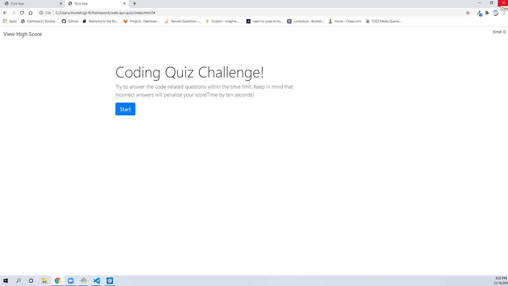
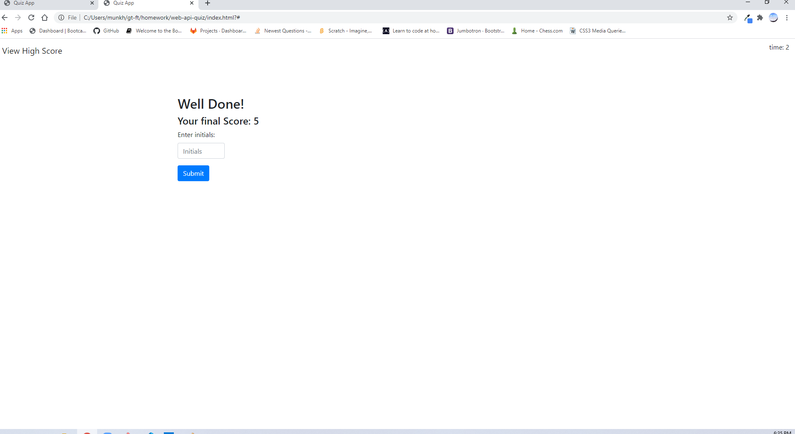

# web-api-quiz

## Project Description "Coding Quiz Challenge!"

 that incorrect answers will penalize scoreTime by ten seconds!
This timed coding quiz with five simple questions. This app will run in the browser, and will feature dynamically updated HTML and CSS powered by JavaScript. It will have a clean, polished, and responsive user interface. 

WHEN You click the start button
THEN a timer starts and I am presented with a question
WHEN You answer a question
THEN I am presented with another question
WHEN I answer a question incorrectly
THEN time is subtracted from the clock
WHEN all questions are answered or the timer reaches 0
THEN the quiz is over
THEN You can save my initials and score

**Technologies used:** 
* HTML
* CSS
* Javascript
* API-DOM
* Bootstrap

### Research Link

* [Google](https://www.google.com)
* [w3school.com](https://www.w3schools.com/html/html5_semantic_elements.asp)
* [developer.mozilla.org](https://developer.mozilla.org/en-US/docs/Glossary/Semantics)
* [stackoverflow.com/](https://stackoverflow.com//)

## Application links

* [deployed application](https://mugich.github.io/password-generator/)

* [GitHub repositories](https://github.com/mugich/password-generator)

### Application's appearance

