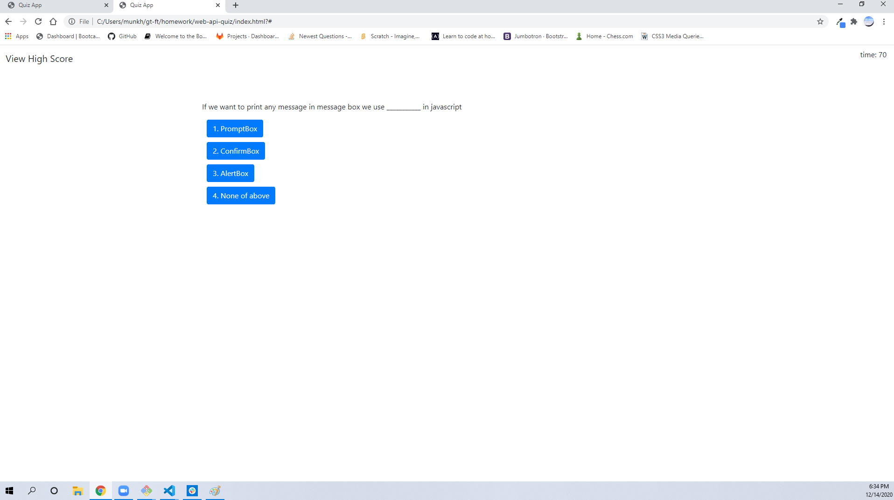

# web-api-quiz

## Project Description "Coding Quiz Challenge!"

This is a timed coding quiz with five simple questions. Incorrect answers will penalize scoreTime by ten seconds! This app will run in the browser, and will feature dynamically updated HTML and CSS powered by JavaScript. It will have a clean, polished, and responsive user interface.

When the user clicks the start button then a timer starts and they will be presented with a question.  When the user answers a question then they are presented with another question. When the user answers a question incorrectly then time is subtracted from the timer.  When all questions are answered or the timer reaches 0  the quiz is over. Then the user can save their initials and score.

**Technologies used:** 
* HTML
* CSS
* Javascript
* API-DOM
* Bootstrap

### Research Link

* [Google](https://www.google.com)
* [w3school.com](https://www.w3schools.com/html/html5_semantic_elements.asp)
* [developer.mozilla.org](https://developer.mozilla.org/en-US/docs/Glossary/Semantics)
* [stackoverflow.com/](https://stackoverflow.com//)

### Application links

* [deployed application](https://mugich.github.io/web-api-quiz/)

* [GitHub repositories](https://github.com/mugich/web-api-quiz)

### Application's appearance

